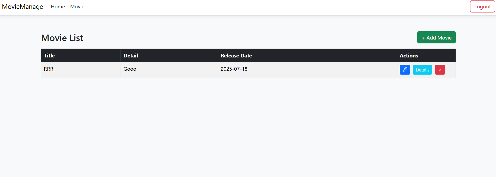
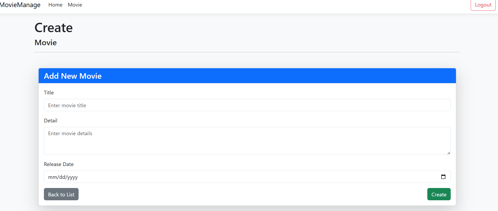

🎮 MovieManage - ASP.NET Core MVC Project

A simple web application to manage movies, including user registration, login with JWT + cookie-based authentication, and full CRUD operations for movies.

📦 Project Structure

Controllers/ – MVC controllers for Login, Movie, Home, etc.

Models/ – Entity Framework database models.

ViewModel/ – View-specific models with validation.

Repository/ – Data access layer.

Service/ – Business logic layer.

Middleware/ – Custom filters for authentication.

🛠️ Project Setup Instructions

Prerequisites

.NET 9 SDK

SQL Server (LocalDB or SQL Server Express)

Visual Studio

1. Clone the Repo

git clone https://github.com/bhavadip9/MovieManage.git
cd MovieManage

2. Database Setup

Create a database named UserMovieDB in SQL Server.

Update your connection string in appsettings.json:

"ConnectionStrings": {
  "UserMovieDB": "Server=DESKTOP-F1KOQJT\\SQLEXPRESS;Database=UserMovieDB; TrustServerCertificate=True;"
}

3. Run Migrations (Optional if DB already exists)

dotnet ef database update

4. Run the Project

dotnet watch

Navigate to https://localhost:5018 .

🤛 Assumptions

JWT tokens are stored in cookies (jwt-token).

No role-based permission is applied for Movie CRUD pages.

Middleware only checks login status — no roles.

UserRegisterViewModel handles registration, with email and phone validation.

Movie release date is entered using DateOnly.

🔐 Login Details (Demo)

After registration, you can login with that email.

JWT is created upon successful login and stored in cookies.

📸 Screenshots

### 1. Login Page

### 1. Login Page

### 2. Movie List Page

### 3. Add Movie Form

You can take screenshots and save them in a folder named wwwroot/screenshots/ or project root /screenshots/.

